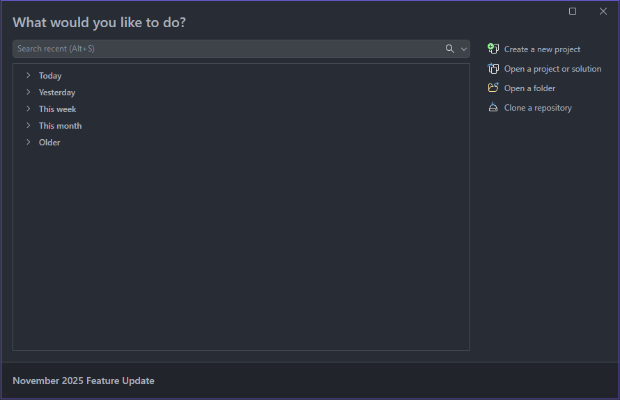
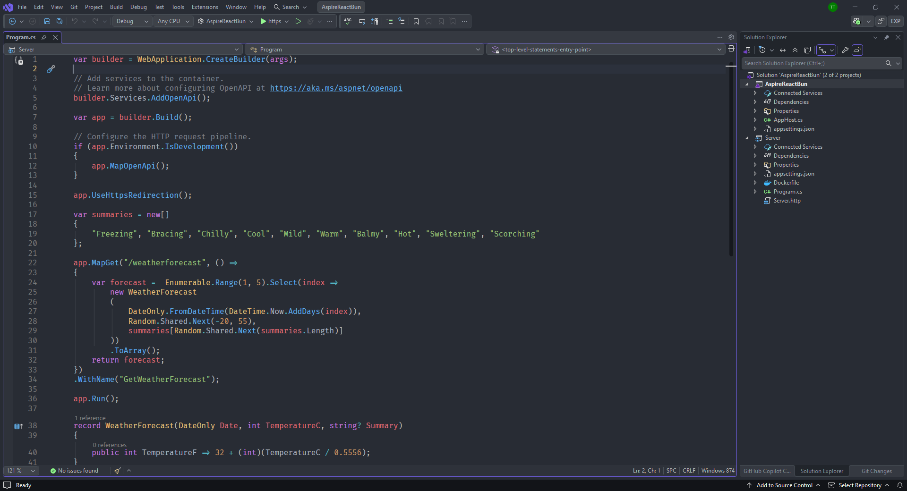
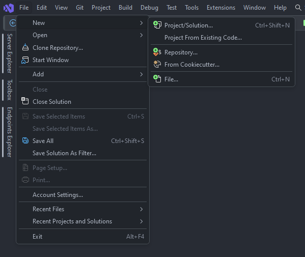

[marketplace]: https://marketplace.visualstudio.com/items?itemName=T5ive.OneDarkProPlus
[repo]:https://github.com/T5ive/OneDarkProPlus
[adrain]: https://github.com/AdrianWilczynski/OneDarkPro
[designer]: https://marketplace.visualstudio.com/items?itemName=ms-madsk.ColorThemeDesigner
[binaryify]: https://marketplace.visualstudio.com/items?itemName=zhuangtongfa.Material-theme
# One Dark Pro Plus - theme for Visual Studio

Download this extension from the [Visual Studio Marketplace][marketplace].

----------------------------------------

**Note!** This theme requires Visual Studio 2026 or newer.

"One Dark Pro Plus" theme, originally based on [Adrian Wilczyński's One Dark Pro][adrain], has been updated using the [Visual Studio Color Theme Designer][designer] in Visual Studio 2026 to support the latest version and has been refined to more closely match the [One Dark Pro theme][binaryify] by Binaryify for Visual Studio Code.

